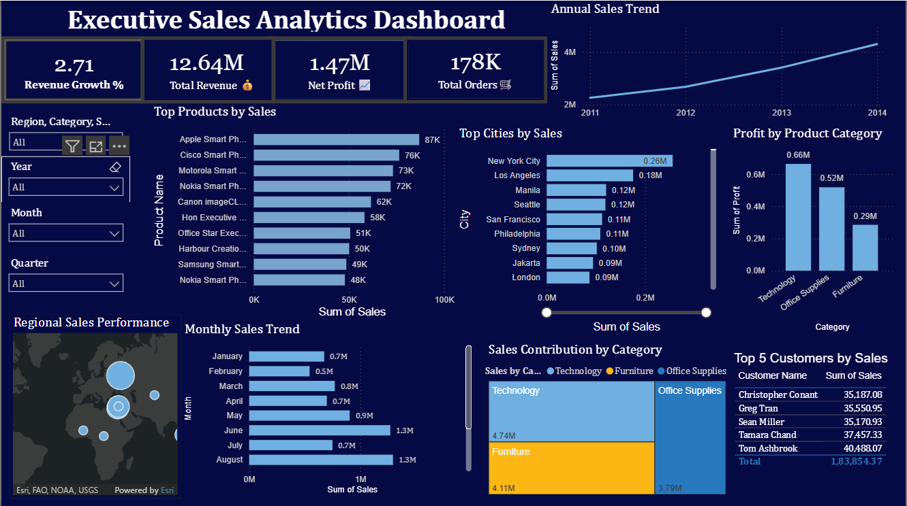

# Executive Sales Analytics Dashboard

## Overview

This Power BI dashboard provides insights into sales performance, profitability, customer behavior and regional trends.

## Features

- Revenue Growth Analysis
- Total Revenue Tracking
- Net Profit Monitoring
- Top Products by Sales
- Top Cities by Sales
- Top Customers by Sales
- Monthly Sales Trend Analysis
- Category-wise Sales Contribution

## Tools Used

- Power BI
- DAX
- Power Query
- Excel

## Dashboard Preview

## Key Insights

- Technology category generated the highest sales.
- New York City was the top-performing city.
- Top customers contributed significantly to revenue.
- Monthly sales trends revealed seasonal patterns.

## Skills Demonstrated

- Data Cleaning (Power Query)
- Data Modeling
- DAX Measures
- KPI Reporting
- Data Visualization
- Business Intelligence
